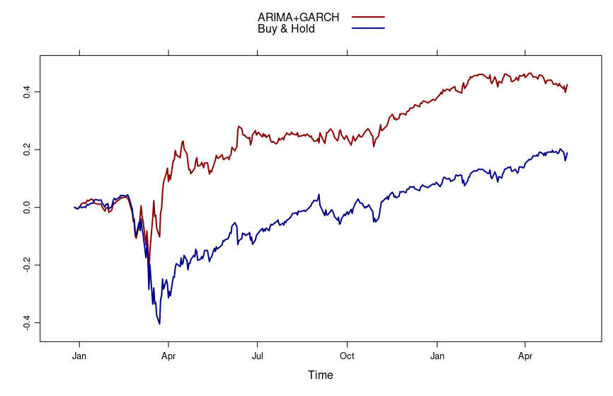

# ARIMA+GARCH Trading Strategy on S&P500 
## Strategy
1. For each day n, the previous k days of the differenced log returns of a stock market index are used as a window for fitting an optimal ARIMA and GARCH model.
2. The combined model used to make a prediction for the next day returns.
3. We will long the position if the prediction is 1 (positive), short if the prediction is -1 (negative)

There are no considerations of slippage, transaction costs, etc. taken into account.

## Implementation
- The `quantmod` R package is used to retrieve data from 2018-01-01 to 2021-05-14 (the last trading day available at the time of this writing)
- A vector, `forecasts`, created to store forecast values for particular dates
- We loop through each trading day to find an approrpiate ARIMA and GARCH model for the rolling window of length `k` (500 in this case)
- The `arimaFit` is wrapped into the try/catch block to ensure that if a fit is not found for a paricular value of p and q, it ignores it and moves on to the next combination of p and q
- The mean takes on an ARMA(p,q) model, whereas the variance takes on a GARCH(1,1) model, and the skewed generalized error distribution (sged) is used for the errors
- the forecasts are written into a csv file

We cannot simply use the csv file we generated from our implementation to do any backtesting: The file contains predictions for "tomorrow's" direction. This introduces a look-ahead bias as the prediction value would use data not known ahead of time. We use `script.py` to remove this bias.

## Comparing ARIMA+GARCH with Buy-and-Hold
- Over the approximate 1.5 year period, the ARIMA+GARCH strategy has significantly outperformed Buy-and-Hold
- Most of the gains were realized during March/April 2020, when the S&P500 had just started to bounce back after losing a considerable portion of its value the months prior

## References
https://www.quantstart.com/articles/ARIMA-GARCH-Trading-Strategy-on-the-SP500-Stock-Market-Index-Using-R/
